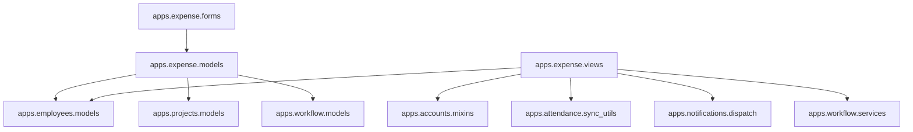
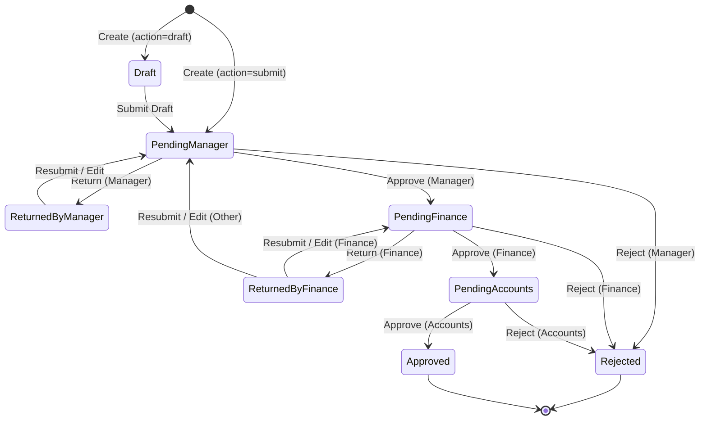

# Enterprise Audit Report: Expense Module (FieldTrack ERP)

This document contains a comprehensive enterprise audit and business analysis of the CURRENT Expense module within the FieldTrack ERP system.

---

## 1. Business Purpose

### Why This Module Exists
- Centralize employee-initiated business expenditure recording, routing, auditing, and reimbursement tracking.
- Ensure cost control by routing employee expense claims through the organizational approval hierarchy.

### Business Goals
- Eliminate manual expense tracking sheets and physical receipt aggregation errors.
- Reduce reimbursement cycle times.
- Prevent unauthorized expenditure by linking claims to active company projects.
- Mitigate financial risk by enforcing validation rules (e.g. file size caps, file extensions).

### Business Responsibilities
- **Staff / Employees**: Record individual expenditures with receipts, categories, project alignments, and descriptions.
- **Reporting Managers**: Review direct report submissions for operational relevance and policy compliance.
- **Finance Team**: Audit tax correctness, category alignment, and financial policy conformity.
- **Accounts Team**: Verify bank details and execute final disbursement.

### Actors
1. **Submitter (Employee)**: Initiates claim; can save as draft, edit returned claims, and resubmit.
2. **Reviewer Level 1 (Manager)**: Evaluates claims from direct team members. Can approve, return for correction, or reject.
3. **Reviewer Level 2 (Finance)**: Audits overall expense request properties. Can approve, return, or reject.
4. **Reviewer Level 3 (Accounts)**: Executes final disbursement approval. Can approve or reject (cannot return).
5. **System Administrator (Admin)**: Full bypass access to approve, return, or reject at any workflow stage.

### Primary Business Process
1. Employee creates a draft or submits an expense claim.
2. If submitted, status changes to `pending_manager`, initiating the `expense_approval` workflow instance.
3. Manager reviews. If approved, progresses to `pending_finance`. If returned, status becomes `returned_by_manager`. If rejected, status becomes `rejected`.
4. Finance reviews. If approved, progresses to `pending_accounts`. If returned, status becomes `returned_by_finance`. If rejected, status becomes `rejected`.
5. Accounts reviews. If approved, status becomes `approved` (fully approved/disbursed). If rejected, status becomes `rejected`.
6. Employee edits any returned claims and resubmits, repeating the cycle.

---

## 2. Current Architecture

### Folder Structure
```
apps/expense/
├── __init__.py
├── admin.py          # Admin site registrations and list/search configurations
├── apps.py           # Django AppConfig for application initialization
├── forms.py          # Form validation rules (size limits, allowed extensions)
├── migrations/       # DB schema migrations (0001_initial to 0004_...)
├── models.py         # DB schema, status choices, workflow post_save signals
├── tests.py          # Django TestCase suite (idempotency, workflow states, permissions)
└── views.py          # Staff & Admin views, custom business logic, stage authorization mixins
```

### Responsibility of Every File
- **models.py**: Defines data structures (`ExpenseCategory`, `Expense`, `ExpenseReturnEvent`, `ExpenseHistory`). Implements post_save receiver signals to sync with the `apps.workflow` module.
- **views.py**: Implements CBVs for list, detail, create, and update actions. Encapsulates permission verification in `BaseProcessExpenseView`.
- **forms.py**: Holds client-side layout specifications and backend validation for attachments.
- **admin.py**: Configures ModelAdmin list displays, filters, search fields, and read-only fields.
- **tests.py**: Validates Ajax creation, idempotency, multi-stage approval flows, permissions, and returns.

### Dependency Graph


### Coupling
- **Tight Coupling**: Highly coupled to `apps.employees` (via `EmployeeProfile` and manager org-hierarchy checks) and `apps.workflow` (via signals and workflow instances).
- **Loose Coupling**: Linked to `apps.projects` (SET_NULL on project deletion) and `apps.notifications` (dispatched via activity logging).

### Ownership
- The **Expense** module owns `ExpenseCategory`, `Expense`, `ExpenseReturnEvent`, and `ExpenseHistory`.
- It consumes employee structures from **Employees**, project identities from **Projects**, and routing state machines from **Workflow**.

---

## 3. Database Analysis

### Tables

#### 1. `expense_expensecategory`
- **Purpose**: Defines standard categorization of business expenses.
- **Columns**:
  - `id`: Auto-incrementing primary key.
  - `name`: CharField (max 100, unique, index).
  - `code`: CharField (max 50, unique).
  - `description`: TextField.
  - `is_active`: BooleanField (default True).
- **Relationships**: Parent to `Expense` and `ExpenseHistory` (foreign keys).
- **Indexes & Constraints**: Unique constraints on `name` and `code`.
- **Audit/Activity/Versioning**: None.

#### 2. `expense_expense`
- **Purpose**: Holds transactional details of expense claims.
- **Columns**:
  - `id`: Auto-incrementing primary key.
  - `employee_id`: ForeignKey to `EmployeeProfile`.
  - `project_id`: ForeignKey to `Project` (nullable).
  - `amount`: DecimalField (max 10 digits, 2 decimal places).
  - `category_id`: ForeignKey to `ExpenseCategory` (nullable).
  - `description`: TextField.
  - `attachment`: FileField (stored in `expenses/`, nullable).
  - `status`: CharField (max 30, choices: `draft`, `pending_manager`, `pending_finance`, `pending_accounts`, `approved`, `rejected`, `returned`, `returned_by_manager`, `returned_by_finance`).
  - `requested_at`: DateTimeField (auto_now_add).
  - `sync_uuid`: UUIDField (unique, default uuid4).
  - `client_event_time`: DateTimeField (nullable).
  - `synced_at`: DateTimeField (nullable).
  - `reviewed_by_id`: ForeignKey to `CustomUser` (nullable).
  - `reviewed_at`: DateTimeField (nullable).
  - `rejection_reason`: TextField (nullable).
- **Relationships**: Cascades on `EmployeeProfile` deletion. Nulls on `Project` and `ExpenseCategory` deletion.
- **Indexes**:
  - Index on `status`.
  - Index on `employee_id`.
  - Index on `category_id`.
  - Index on `requested_at`.
- **Soft Delete**: NOT IMPLEMENTED.
- **History/Audit/Activity**: Logged via `ExpenseHistory` and `ActivityLog`.

#### 3. `expense_expensereturnevent`
- **Purpose**: Logs detail when a claim is returned for correction.
- **Columns**:
  - `id`: Auto-incrementing primary key.
  - `expense_id`: ForeignKey to `Expense`.
  - `returned_by_id`: ForeignKey to `CustomUser`.
  - `returned_from_status`: CharField (max 50).
  - `reason`: TextField.
  - `fields_to_correct`: JSONField (default list).
  - `due_date`: DateField (nullable).
  - `attachment`: FileField (stored in `expenses/returns/`, nullable).
  - `created_at`: DateTimeField (auto_now_add).
- **Relationships**: Cascades on `Expense` deletion.
- **Audit/Activity**: Serves as audit trail for corrections.

#### 4. `expense_expensehistory`
- **Purpose**: Preserves snapshot of original fields when a claim is edited and resubmitted.
- **Columns**:
  - `id`: Auto-incrementing primary key.
  - `expense_id`: ForeignKey to `Expense`.
  - `updated_by_id`: ForeignKey to `CustomUser` (nullable).
  - `amount`: DecimalField (max 10 digits, 2 decimal places).
  - `category_id`: ForeignKey to `ExpenseCategory` (nullable).
  - `description`: TextField.
  - `attachment`: FileField (stored in `expenses/history/`, nullable).
  - `changed_at`: DateTimeField (auto_now_add).
- **Relationships**: Cascades on `Expense` deletion.

---

## 4. Data Ownership

| Field / Object | Data Type | Owner Module |
| :--- | :--- | :--- |
| **EmployeeProfile** | Reference Data | `employees` |
| **Employee (Master)** | Master Data | `employees` |
| **Project** | Reference Data | `projects` |
| **ExpenseCategory** | Reference Data | `expense` |
| **Expense Amount** | Transactional Data | `expense` |
| **Expense Status** | Transactional Data | `expense` (Synced with `workflow`) |
| **Expense Attachment** | Transactional Data | `expense` |
| **Expense Return Event** | Transactional Data | `expense` |
| **Expense History** | Transactional Data | `expense` |
| **WorkflowInstance** | Transactional Data | `workflow` |

---

## 5. Business Rules

### Validation Rules
- **Maximum Amount**: No maximum limit enforced in backend code (limited only by field capacity `99,999,999.99`).
- **Required Fields**: `amount`, `category`, and `description` are required. `project` and `attachment` are optional.
- **Attachment Rules**:
  - Size cap: Max 5MB (`forms.py` validates `attachment.size > 5 * 1024 * 1024`).
  - Allowed file types: `.pdf`, `.jpg`, `.jpeg`, `.png`, `.webp`.

### Workflow & Transition Rules
- **Edit Rules**:
  - Submitter can only edit claims in status `draft`, `returned`, `returned_by_manager`, or `returned_by_finance`.
  - Attempts to edit active pending reviews raise `PermissionDenied`.
- **Submission Rules**:
  - Account suspension checks block submission if the employee's `master_employee.is_suspended` is true (raises `PermissionDenied`).
  - Creation checks for duplicate `sync_uuid` to enforce idempotency.
- **Self-Approval Restriction**:
  - Users are strictly prohibited from approving their own expense claims (returns HTTP 403 Forbidden).

---

## 6. Current Workflow



---

## 7. Approval Process

### Approval Levels
- **Level 1**: Manager Stage (`pending_manager` to `pending_finance`).
- **Level 2**: Finance Stage (`pending_finance` to `pending_accounts`).
- **Level 3**: Accounts Stage (`pending_accounts` to `approved`).

### Approver Selection Logic
- **Manager Stage**:
  - Evaluates direct manager links: `employee.master_employee.reporting_manager`.
  - Evaluates management chain hierarchy via `OrgHierarchyService.is_manager_of`.
  - Evaluates active manager delegations (`ManagerDelegation`).
- **Finance Stage**:
  - Restricts access to users with role `finance` or permission `expense.approve`.
- **Accounts Stage**:
  - Restricts access to users with role `accounts`.
- **Superuser/Admin Bypass**:
  - Users marked as `is_superuser` or with role `admin` can approve/process claims at any stage.

### Escalation & Delegation
- **Escalation**: System supports escalation to `admin` if SLA is breached (configured in `seed_workflow_definitions` with `sla_hours=48`).
- **Delegation**: Checks `ManagerDelegation` and `WorkflowDelegation` dynamically.

---

## 8. Payment Lifecycle

- **Payment Process / Disbursement**: Executed at the Accounts stage when the claim is marked `approved`.
- **Advance Adjustment**: NOT IMPLEMENTED.
- **Payment Methods**: Configured in Employee profile (`bank`, `cash`, `mobile`), but the Expense module has no direct financial integration.
- **Partial / Multiple Payments**: NOT IMPLEMENTED.
- **Double Entry Journal / Tally Sync**: NOT IMPLEMENTED.

---

## 9. Attachment System

- **Storage**: Media root under `expenses/`, `expenses/returns/`, and `expenses/history/`.
- **Validation**: Enforced via `ExpenseForm.clean_attachment` (5MB limit, PDF/Image extension checks).
- **Preview**: Inline preview is available for images in `detail.html`. For PDF and other formats, links open in a new tab.
- **Retention / Deletion / Versioning**:
  - File replacement occurs on edit (overwriting fields).
  - Versioning is handled manually by capturing snapshots in the `ExpenseHistory` table during resubmission.

---

## 10. Notifications

- **In-App Notifications**: Dispatched via `log_activity` when approved, rejected, or returned. Notifications are saved in the `Notification` model.
- **Email Notifications**: Supported but only triggered on SLA breaches (`task_delayed` workflow events) or manually configured email flags in notifications dispatch.
- **SMS / Push Notifications**: NOT IMPLEMENTED.

---

## 11. Reports

- **Expense Reports**: No dedicated reports view.
- **Filters**: Basic filter by status on `AdminExpenseListView` (`?status=all`, `?status=pending`, `?status=approved`, `?status=rejected`).
- **Exports (PDF/Excel)**: NOT IMPLEMENTED.

---

## 12. Permissions

| Role | Submit | Edit (Draft/Returned) | Approve Manager Stage | Approve Finance Stage | Approve Accounts Stage |
| :--- | :--- | :--- | :--- | :--- | :--- |
| **Staff** | Yes | Yes | No | No | No |
| **Manager** | Yes | Yes | Yes (Team only) | No | No |
| **Finance** | Yes | Yes | No | Yes | No |
| **Accounts** | Yes | Yes | No | No | Yes |
| **Admin** | Yes | Yes | Yes (Bypass) | Yes (Bypass) | Yes (Bypass) |

---

## 13. APIs

### Views & Endpoints
- `/expense/staff/`: `StaffExpenseListView`
- `/expense/staff/create/`: `StaffExpenseCreateView` (handles form templates and AJAX JSON postings)
- `/expense/staff/<pk>/`: `ExpenseDetailView`
- `/expense/staff/<pk>/edit/`: `StaffExpenseUpdateView`
- `/expense/staff/<pk>/submit/`: `SubmitExpenseDraftView`
- `/expense/admin/`: `AdminExpenseListView`
- `/expense/admin/<pk>/approve/`: `ApproveExpenseView`
- `/expense/admin/<pk>/reject/`: `RejectExpenseView`
- `/expense/admin/<pk>/return/`: `ReturnExpenseView`

### HTMX / AJAX / Forms
- AJAX/JSON support in create and update views to capture offline/synced records.
- Enforces duplicate submission prevention checks using the `sync_uuid` token.

---

## 14. Dashboard Integration

- **Employee Dashboard**: `my_expenses` lists the last 5 expense claims.
- **Manager Dashboard**: `pending_expense_approvals` filters claims where status is `pending_manager` and the employee reports to the manager.
- **Admin Dashboard**: `pending_expense_approvals` aggregates total count across all approval stages.
- **Live Updates / Caching**: No caching layers; database is queried live.

---

## 15. Audit & Activity

- **Audit Logs**: Every status change creates an `ActivityLog` entry.
- **Expense History**: Modifying a returned or draft claim saves the previous `amount`, `category`, `description`, and `attachment` in `ExpenseHistory`.
- **Return Tracking**: `ExpenseReturnEvent` records details of corrections requested.

---

## 16. Dependencies

- **Consumes**:
  - `apps.employees` (via `EmployeeProfile` and hierarchy structures).
  - `apps.projects` (via `Project`).
- **Produces**:
  - `apps.workflow` (instantiates and drives the workflow state machine).
  - `apps.notifications` (fires activity logging events).

---

## 17. Technical Debt

- **Missing Category Administration**: There is no frontend interface to add/modify `ExpenseCategory` data; registrations must be made directly in Django admin or via backend seeder.
- **No Limit Policies**: Lack of category-wise threshold policies or maximum allowance rules.
- **Direct DB Updates on Sign-off**: Bypassing workflow steps during approval checks might cause data desync between `Expense.status` and `WorkflowInstance.current_status` if db-level exceptions occur during post-save signals.

---

## 18. Enterprise Gap Analysis

| Feature | Oracle Fusion / SAP Concur | Current FieldTrack Status | Enterprise Standard Gap |
| :--- | :--- | :--- | :--- |
| **Audit Rule Engine** | Policy violation warnings, duplicate detection, travel mileage limits | NOT IMPLEMENTED | Lack of programmatic compliance audits |
| **OCR / Receipt Parsing** | Automatically extract text, amounts, dates, and vendors from photos | NOT IMPLEMENTED | Manual entry required |
| **Financial System Sync** | Automated double-entry journals, Tally/SAP/NetSuite GL feeds | NOT IMPLEMENTED | Requires manual reconciliation |
| **Corporate Card Feed** | Automatically pull credit card statement lines to claim expenses | NOT IMPLEMENTED | Users must manually key every line |

---

## 19. Final Summary

- **KEEP**: Custom workflow integration, manager delegations, offline-first sync tokens (`sync_uuid`), and correction history tracking.
- **CHANGE**: Centralize leave and expense policies; move approval mixins out of `views.py` and into reusable services.
- **REMOVE**: Redundant hardcoded role checks in views (replace entirely with `PermissionEngine`).
- **REPLACE**: Manual file validators with centralized file management pipelines.
