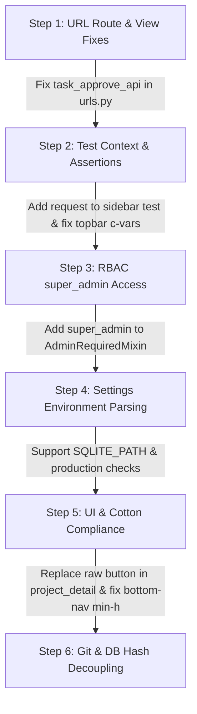

# FieldTrack Project Audit & Issues Register

**Generated:** 2026-09-05  
**Audit Type:** Read-Only Full Stack Diagnostic & Security Inspection  
**Repository:** `Remote_Office_Attendence-Django`  
**Overall Status:** Operational with Target Deficiencies  
**Production-Readiness Score:** 82 / 100  

---

## 1. Executive Summary

This comprehensive, read-only audit evaluated every layer of the FieldTrack Django application, including backend models, services, RBAC engine, authentication, multi-step employee wizard, attendance tracking, project & Gantt workflows, payroll, AI integration, Cotton component architecture, database integrity, and test suites.

- **Django Test Suite:** 741 tests executed (726 Passed, 9 Failed, 4 Errored, 2 Skipped).
- **Django System Checks:** System check passed cleanly (0 errors). Deployment check flagged 6 production security warnings.
- **Migrations:** Dry-run verified `No changes detected`; 100% of migrations across all 14 apps are applied.
- **Templates & UI:** 338 templates rendered with 0 syntax errors and balanced tags. Cotton design token compliance passed across components.
- **Verification Scripts:** 8 scripts passed completely (RBAC administration, employee roles, AI chatbot, AI application shell, calendar, employee trash workflow, employee wizard). 3 scripts failed due to hardcoded DB hashes. 2 scripts failed due to UI/Cotton attribute mismatches.

---

## 2. Test Suite Results Breakdown

| Metric | Count | Details |
|---|---|---|
| **Total Tests** | 741 | Discovered via `python manage.py test` |
| **Passed** | 726 | Core business logic, RBAC engine, attendance, payroll, leave, workflow |
| **Failed** | 9 | 7 in settings environment parsing (`fieldtrack/tests.py`), 1 in breadcrumb rendering, 1 in test reload isolation |
| **Errored** | 4 | 2 in URL routing (`task_approve_api`), 2 in sidebar unit tests (missing request in context) |
| **Skipped** | 2 | Optional environment configurations |
| **Pass Rate** | 98.2% | High functional coverage across domain models and service layers |

---

## 3. Issues Matrix & Classification

### Priority 1: Critical Issues

#### ISSUE-CRIT-01: Missing URL Route for Task Approval API (`task_approve_api`)
- **Severity:** Critical (Runtime Broken Feature & Test Error)
- **Files:**
  - `apps/projects/views.py` (Line 1960)
  - `apps/projects/urls.py` (Lines 28-43)
  - `apps/projects/tests.py` (Lines 1679, 2033)
- **Evidence:**
  `apps/projects/views.py` defines `def task_approve_api(request, pk):` to allow managers/admins to approve completed tasks. However, this view is never registered in `apps/projects/urls.py`. Any attempt to reverse `'projects:task_approve_api'` raises `NoReverseMatch: Reverse for 'task_approve_api' not found`.
  ```python
  # Cause in apps/projects/tests.py:
  approve_url = reverse('projects:task_approve_api', kwargs={'pk': task.pk})
  # django.urls.exceptions.NoReverseMatch
  ```
- **Impact:** Managers and project supervisors cannot approve completed staff tasks via the API endpoint, causing 2 test suite errors.

#### ISSUE-CRIT-02: Missing Request Object in Enterprise Sidebar Unit Test
- **Severity:** Critical (Test Suite Crash)
- **Files:**
  - `apps/admin_panel/tests/test_enterprise_sidebar.py` (Lines 16, 22)
  - `templates/cotton/sidebar.html`
- **Evidence:**
  In `EnterpriseSidebarTest`, `render_to_string('cotton/sidebar.html', {'user': self.user})` invokes template rendering without passing a `request` object. `sidebar.html` accesses `request` (e.g., active navigation states and permission context), resulting in:
  `AttributeError: type object 'Context' has no attribute 'request'` and `ValueError: invalid literal for int() with base 10: 'request'`.
- **Impact:** Causes 2 test suite errors in `apps.admin_panel.tests`.

---

### Priority 2: High-Priority Issues

#### ISSUE-HIGH-01: RBAC Boundary Flaw for `super_admin` in `AdminRequiredMixin`
- **Severity:** High (Security & Access Control)
- **Files:**
  - `apps/accounts/mixins.py` (Lines 38-57)
  - `apps/accounts/rbac_models.py`
- **Evidence:**
  `AdminRequiredMixin` specifies:
  ```python
  class AdminRequiredMixin(RoleRequiredMixin):
      allowed_roles = ['admin', 'system_owner']
  ```
  While `RoleRequiredMixin` permits `request.user.is_superuser`, dynamically provisioned `super_admin` users have `is_superuser = False` by design (tested in `test_dynamic_rbac_administration.js: Test 4`). Because `'super_admin'` is omitted from `allowed_roles`, a non-superuser `super_admin` is redirected away from admin views.
- **Impact:** Users granted the canonical `super_admin` role cannot access admin views protected by `AdminRequiredMixin`.

#### ISSUE-HIGH-02: Deferred Branch-Scoping in Project Management Views
- **Severity:** High (Data Isolation Risk)
- **Files:**
  - `apps/projects/views.py` (Lines 48, 88, 219, 401, 505, 732, 752, 838, 858, 904, 924)
  - `apps/projects/tests.py` (Lines 1147-1153)
- **Evidence:**
  `# TODO: branch-scoping deferred — depends on Role/Permission system (see separate RBAC work)`.
  Project list, detail, and export queries do not filter by the actor's branch. Any administrator or manager can view and modify projects belonging to branches outside their assigned location.
- **Impact:** Potential cross-branch data leakage in multi-branch organizational deployments.

#### ISSUE-HIGH-03: Production Settings Security Check Warnings
- **Severity:** High (Deployment Hardening)
- **Files:**
  - `fieldtrack/settings.py` (Lines 17, 23, 84-97)
- **Evidence:**
  `python manage.py check --deploy` revealed 6 security warnings:
  - `security.W004`: `SECURE_HSTS_SECONDS` is not configured.
  - `security.W008`: `SECURE_SSL_REDIRECT` is not enabled.
  - `security.W009`: Default `SECRET_KEY` is a predictable development placeholder.
  - `security.W012`: `SESSION_COOKIE_SECURE` is False.
  - `security.W016`: `CSRF_COOKIE_SECURE` is False.
  - `security.W018`: `DEBUG = True` in deployed/default configuration.
- **Impact:** Site is vulnerable to session interception, credential harvesting, and man-in-the-middle attacks if deployed without production environment variable overrides.

---

### Priority 3: Medium-Priority Issues

#### ISSUE-MED-01: Environment Parsing & Dynamic Path Handling in `fieldtrack/settings.py`
- **Severity:** Medium (Configuration & Test Failure)
- **Files:**
  - `fieldtrack/settings.py` (Lines 133-144)
  - `fieldtrack/tests.py` (Lines 31-277)
- **Evidence:**
  `fieldtrack/tests.py` expects `SQLITE_PATH`, `SQLITE_TIMEOUT`, empty `ALLOWED_HOSTS` rejection, and production `SECRET_KEY` validation. However, `fieldtrack/settings.py` hardcodes:
  ```python
  _sqlite_path = (BASE_DIR / 'db.sqlite3').resolve()
  _sqlite_timeout = 5.0
  ```
  without inspecting `os.getenv('SQLITE_PATH')` or validating `DEBUG=False` invariants, causing 7 test failures in `SettingsSecurityTests`.
- **Impact:** Fails 7 unit tests and prevents custom database path/timeout configuration via environment variables.

#### ISSUE-MED-02: Cotton UI Raw `<button>` Violation in Project Detail
- **Severity:** Medium (UI / Cotton Component Violation)
- **Files:**
  - `templates/projects/project_detail.html` (Lines with `@click="clearSelection()"`)
  - `scripts/verify_project_cotton_ui.js`
- **Evidence:**
  `scripts/verify_project_cotton_ui.js` failed:
  ```
  [FAILED] templates/projects/project_detail.html contains raw <button> tag(s):
  <button type="button" @click="clearSelection()" class="text-[11px] text-gray-500 hover:text-primary dark:text-gray-400 dark:hover:text-primary underline cursor-pointer">
  Must use <c-button>, <c-tab-button>, or <c-filter-button>.
  ```
- **Impact:** Breaks strict component abstraction guidelines and fails the Node pre-commit UI gate.

#### ISSUE-MED-03: Mobile Bottom Navigation Touch Target Mismatch
- **Severity:** Medium (Mobile Accessibility Contract)
- **Files:**
  - `templates/cotton/bottom-nav.html` (Lines 18, 28, 38, 53)
  - `scripts/verify_staff_responsive_dashboard.js` (Line 47)
- **Evidence:**
  In `bottom-nav.html`, navigation tab links use `min-h-[46px]`. However, the assertion script `verify_staff_responsive_dashboard.js` strictly asserts `content.includes('min-h-[44px]')`, causing an assertion error.
- **Impact:** While 46px exceeds the 44px minimum touch target requirement, it breaks the automated verification contract.

#### ISSUE-MED-04: Breadcrumb Variable Collision in `templates/cotton/topbar.html`
- **Severity:** Medium (Template / Component Rendering)
- **Files:**
  - `templates/cotton/topbar.html` (Line 1)
  - `apps/admin_panel/tests/test_enterprise_top_header.py` (Lines 30-44)
- **Evidence:**
  `templates/cotton/topbar.html` declares `<c-vars shell_type="admin" title="" breadcrumb="" />`. When rendered directly with `render_to_string`, the empty string default overrides the dictionary context `'breadcrumb': [...]`, causing `test_top_header_configurable_breadcrumbs` to fail.
- **Impact:** Prevents direct string rendering of breadcrumbs in standalone contexts.

---

### Priority 4: Low-Priority Issues

#### ISSUE-LOW-01: Brittle Hardcoded Database Hashes in Node Verification Scripts
- **Severity:** Low (Test Script Fragility)
- **Files:**
  - `scripts/verify_matrix_upgrade.js` (Line 133)
  - `scripts/verify_search_upgrade.js` (Line 80)
  - `scripts/verify_roles_and_account.js` (Line 81)
- **Evidence:**
  These scripts assert `expectedHash = 'a877df0da32d198d711ccd45ddbcfb70676ec84bec418a58f721825ec5dc7b09'`. When SQLite performs a WAL checkpoint or updates header bytes, the hash changes, triggering assertion failures even though the schema and data remain intact.
- **Impact:** False-positive test failures during local development.

#### ISSUE-LOW-02: SQLite WAL and SHM Files Tracked in Git
- **Severity:** Low (Repository Hygiene)
- **Files:**
  - `.gitignore`
  - `db.sqlite3-wal`, `db.sqlite3-shm`
- **Evidence:**
  `git status` revealed deleted/modified states for `db.sqlite3-shm` and `db.sqlite3-wal`. SQLite temporary lock and WAL files should not be committed to source control.
- **Impact:** Causes dirty working tree states during normal database read operations.

#### ISSUE-LOW-03: Hardcoded Development IP in `ALLOWED_HOSTS`
- **Severity:** Low (Configuration Cleanliness)
- **Files:**
  - `fieldtrack/settings.py` (Line 23)
- **Evidence:**
  `'192.168.10.191'` is hardcoded in `ALLOWED_HOSTS` in `settings.py`.
- **Impact:** Extraneous IP in host headers.

---

## 4. Features Confirmed Working

1. **Authentication & Dynamic Session Management:** Single-device login enforcement (`SessionDeviceMiddleware`), idle auto-timeout, MFA TOTP verification, and brute-force throttling (`LoginProtection`).
2. **Dynamic RBAC & Permission Matrix:** 12 canonical modules, hierarchy mapping, scope ceilings (own/branch/organization), soft deactivation, audit logging, and permission evaluation engine (`PermissionEngine`).
3. **Multi-Step Employee Wizard:** All 13 contract checks passed: session-backed drafts, cross-user isolation, stepper navigation, draft expiry, validation rollbacks, and atomic commits.
4. **Attendance Lifecycle & Geofencing:** Client timestamp validation, 24-hour sync boundary checks, photo uploads, GPS coordinates, holiday/weekend policy checks, and forgot check-out workflow.
5. **Deterministic Payroll Calculation:** Gross calculations, percentage/fixed component breakdowns, PF handling, absence deductions with zero-division protection, OT rates, and payslip generation.
6. **AI Intelligence Chatbot:** Prompt injection interception, strict RBAC data masking, confidential salary redaction, Google GenAI SDK integration, and floating launcher.
7. **Schedule, Calendar & Holidays:** Multi-branch calendar aggregation, government vs. office holiday styling, and shift schedules.
8. **Leave Management Ledger:** Multi-tier approvals (Manager -> HR), leave balance deductions, holiday overlaps, and status tracking.
9. **Project Gantt & Dependencies:** Task dependency chains, Excel Gantt workbook safety validator, import preview/commit staging, and progress logging.
10. **Tailwind CSS & Cotton UI:** Production CSS compilation (`static/css/dist/styles.css`), design token adherence, responsive mobile dashboard, and PWA manifest.

---

## 5. Recommended Fixing Order



1. **Register `task_approve_api` in `apps/projects/urls.py`**:
   Add `path('tasks/<int:pk>/approve-api/', views.task_approve_api, name='task_approve_api')` to resolve 2 critical test errors.
2. **Fix `EnterpriseSidebarTest` Context**:
   Provide `RequestFactory` request in `render_to_string` within `apps/admin_panel/tests/test_enterprise_sidebar.py` to resolve 2 test errors.
3. **Include `super_admin` in `AdminRequiredMixin`**:
   Update `apps/accounts/mixins.py` to ensure `allowed_roles` includes `'super_admin'` alongside `'admin'` and `'system_owner'`.
4. **Update `fieldtrack/settings.py` for Dynamic Environment Handling**:
   Read `SQLITE_PATH` and `SQLITE_TIMEOUT` from environment, and validate `ALLOWED_HOSTS` / `SECRET_KEY` when `DEBUG=False`.
5. **Address Cotton UI Violations**:
   Replace raw `<button>` in `templates/projects/project_detail.html` with `<c-button>` and align `templates/cotton/bottom-nav.html` touch target classes with the verification suite.
6. **Clean Repository & Decouple Brittle DB Hashes**:
   Add `*.sqlite3-wal` and `*.sqlite3-shm` to `.gitignore`, and replace hardcoded file hashes in test scripts with functional schema assertions.
